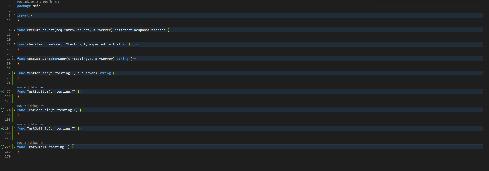

# 🛒 Avito Shop API
Этот проект представляет собой API для магазина Avito, который позволяет пользователям регистрироваться, авторизоваться, покупать товары и управлять своим инвентарем.

## 🚀 Запуск проекта

Для запуска проекта выполните следующие шаги:

Убедитесь, что у вас установлены Docker и Docker Compose.

* Склонируйте репозиторий:

```
git clone https://github.com/nabishec/avito_shop_api.git
cd avito-shop-api
```

* Запустите проект с помощью Docker Compose:

```
docker-compose up
```

* После запуска откройте браузер и перейдите по адресу:

```
http://localhost:8080
```

Для проверки работы API удобнее использовать swagger UI 
описанному в разделе [Документация API](#-документация-api)
## 🛠 Проблемы и решения

**Проблема**: Несоответствие между теоретическим заданием и JSON-файлом
Во время реализации возникла проблема с несоответствием между теоретическим заданием и JSON-файлом. В частности:

В JSON-файле путь /api/auth может возвращать ошибку 401 (Unauthorized).

В теоретическом задании указано, что при первой авторизации пользователь должен регистрироваться, поэтому этот путь не может вернуть ошибку 401. Поэтому в моей документации ее нет.

**Решение**:
Так как в задании указано, что регистрация должна происходить автоматически, путь /api/auth не возвращает ошибку 401, так как при новых учетных данных пользователь автоматически регистрируется.

## 🧪 Тесты
Для проверки корректности работы API были написаны тесты. Эти тесты проверяют:

Корректность работы всех путей API.

Авторизацию и регистрацию пользователей.

Покупку товаров и управление инвентарем.

Все тесты прошли успешно, что подтверждает корректность работы API. На фото ниже видно, что все тесты завершились без ошибок.




## 📄 Документация API
Документация API доступна по адресу:


```
http://localhost:8080/swagger/
```

### 🛠 Технологии

* Go: Основной язык программирования.

* PostgreSQL: База данных.

* Docker: Контейнеризация приложения.

* Swagger: Документация API.

## 📜 Лицензия
Этот проект распространяется под лицензией Apache. Подробности см. в файле LICENSE.

**Если у вас есть вопросы, пожалуйста пишите на почту.**
**Спасибо за внимание! 🚀**